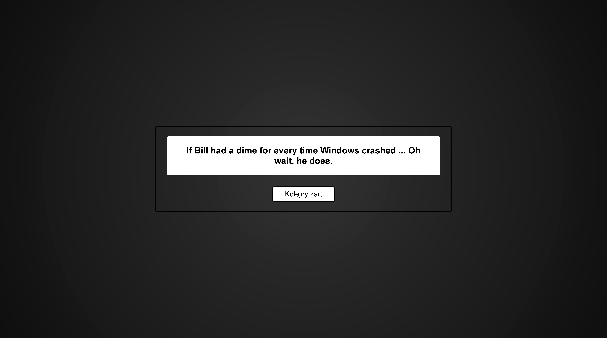
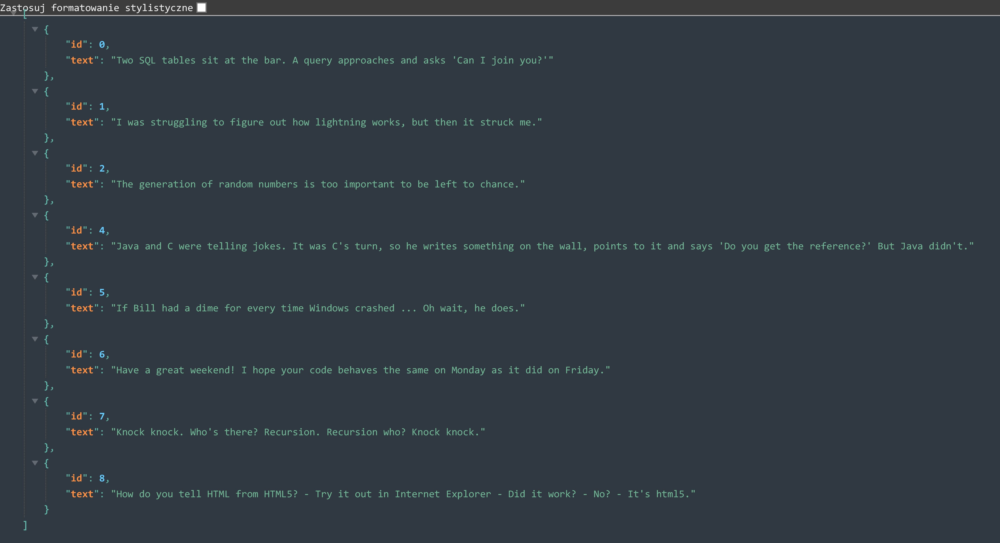
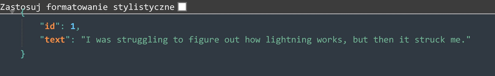
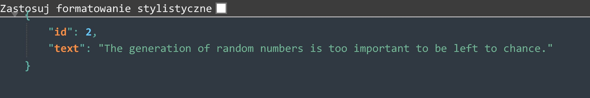

# 😂 Jokes App

A lightweight random joke generator built using **Node.js** (without Express), serving static HTML/CSS/JS and a simple API. No database — jokes are loaded from a local JSON file.

---

## 📁 Project Structure

```
jokes_app/
│
├── controllers/
│   └── jokeController.js      # Business logic for handling jokes
│
├── data/
│   └── jokes.json             # JSON file with all jokes
│
├── model/
│   └── jokeModel.js           # Logic for accessing jokes from file
│
├── static/
│   ├── index.html             # Main HTML page
│   ├── style.css              # Styling for the app
│   └── app.js                 # Frontend logic for fetching jokes
│
├── util/
│   └── staticServer.js        # Serves static files
│
├── screenshots/               # Optional: UI screenshots
│
└── server.js                  # Main Node.js HTTP server
```

---

## 🚀 Getting Started

### ✅ Requirements

- Node.js (v16+ recommended)

### 📦 Installation

1. Clone the repository:

```bash
git clone https://github.com/Jaroslaw-Baumgart/jokes_app
cd jokes_app
```

2. Start the app:

```bash
node server.js
```

3. Open your browser:

```
http://localhost:8080
```

---

## 📡 API Endpoints

| Method | Endpoint              | Description                      |
|--------|-----------------------|----------------------------------|
| GET    | `/api/jokes`          | Returns all jokes in JSON        |
| GET    | `/api/jokes/:id`      | Returns a joke by its ID         |
| GET    | `/api/jokes/random`   | Returns a single random joke     |

---

## 🧠 Joke Format

Jokes are stored in `data/jokes.json` as follows:

```json
{
  "id": 1,
  "text": "I was struggling to figure out how lightning works, but then it struck me."
}
```

---

## 🎨 UI Preview







---

## 📌 Features

- 🔁 Random joke fetch on button click or spacebar press
- 🎯 Clean, minimal frontend using vanilla JavaScript
- 📁 Static file serving (HTML, CSS, JS)
- 🔎 Simple JSON-based API
- ❌ No frameworks — fully manual HTTP server

---

## 🧱 Possible Improvements

- Add POST/PUT/DELETE for managing jokes
- Persist jokes to a real database (e.g. MongoDB)
- Input validation and better error messages
- Improve responsive design

---

## 👨‍💻 Author

Created by **Jarosław Baumgart**

📧 Email: [jaroslawbaumgart@gmail.com](mailto:jaroslawbaumgart@gmail.com)  
🔗 GitHub: [Jaroslaw-Baumgart](https://github.com/Jaroslaw-Baumgart)

---

## 📜 License

This project is licensed under the **MIT License**.
